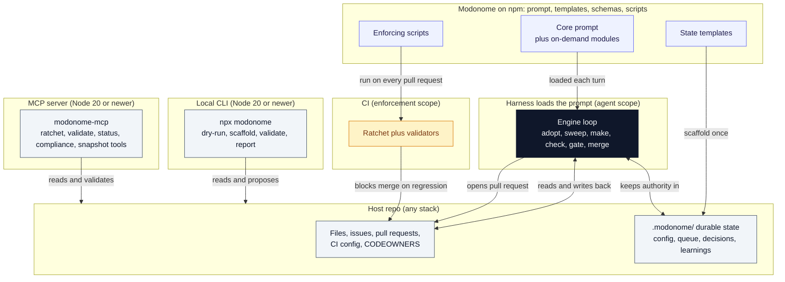
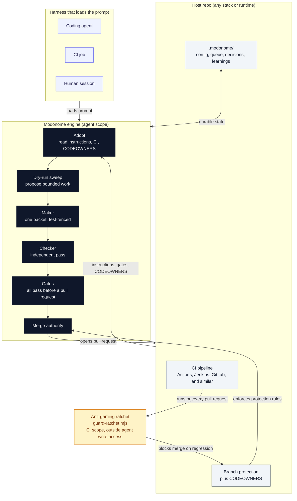
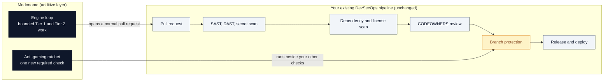
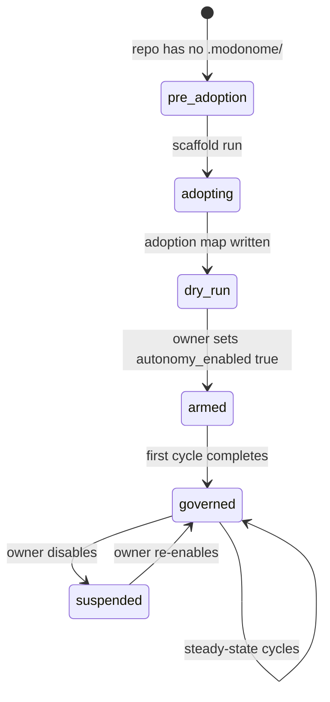
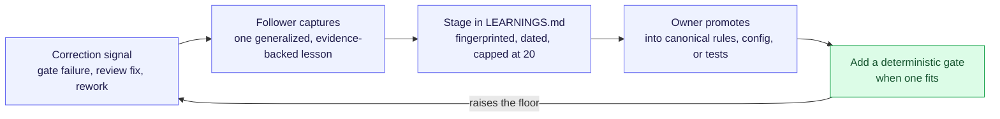

# Architecture

Modonome ships as an npm package: a master prompt, state templates, machine-checkable
schemas, and enforcing scripts. The prompt defines the rules. The templates, schemas, and
scripts make those rules executable and checkable. Modonome runs beside a host repository
and works through the surfaces that repository already has: files, issues, pull requests,
CI checks, CODEOWNERS, and status docs.

Four questions shape everything else, so this document answers them first:

- **What is the engine?** The engine is the running control loop, started when a harness
  loads the prompt. It is the prompt-defined loop operating on the host repo, together with
  the enforcing scripts that run in CI. Loading the prompt starts an engine; the package is
  its definition.
- **When does the prompt run?** A harness loads the core prompt on each turn of a run. The
  adoption pass runs once per repository. The CI ratchet runs on every pull request.
- **Where does it run?** Four places: a local Node CLI for read-only commands, an MCP server
  for harnesses that integrate over the Model Context Protocol instead of shelling out, a
  harness for the loop (agent scope), and CI for the enforcing scripts (enforcement scope).
  One package, four execution contexts, and no central service.
- **How does it relate to the host repo?** Repo-wise, Modonome installs as a development
  dependency and copies its state into the host's `.modonome/` directory. At runtime, it
  reads the host's CI, CODEOWNERS, tests, and conventions, and writes back through pull
  requests and state files.

## Where Modonome runs

| Context | What runs there | When it runs | What it can touch |
| --- | --- | --- | --- |
| Local CLI (Node 20+) | `dry-run`, `scaffold`, `validate`, `report` | On demand, driven by a person | Reads the repo; writes only the `.modonome/` files you choose to scaffold |
| MCP server (Node 20+) | `modonome_ratchet`, `modonome_validate_config`, `modonome_validate_work_item`, `modonome_status`, `modonome_compliance`, `modonome_verify_attestation`, `modonome_snapshot` | On demand, driven by a harness or IDE over stdio | Reads the repo; runs the same read-only checks as the CLI, exposed as callable tools |
| Agent harness (agent scope) | The engine loop: adopt, sweep, make, check, gate | Each harness turn while a run is active | The host's ordinary surfaces: branches, pull requests, and `.modonome/` state |
| CI (enforcement scope) | Ratchet, validators, drift and style guards | On every pull request and on push to the default branch | Read-only judgment. It blocks merges and writes no application code |

## Prerequisites

Modonome degrades gracefully. The read-only CLI and the CI enforcement need only Node.js.
A specific agent framework matters for one tier alone: running the loop autonomously.

| What you want | What it needs | When the environment lacks it |
| --- | --- | --- |
| See proposed work, scaffold state, validate, report | Node.js 20 or newer | Always available once Node is present; nothing else is required |
| CI enforcement: ratchet, validators, drift, style | Node.js 20 or newer in your CI | Run the same scripts locally as a pre-merge gate |
| Run the loop manually, with a person as the harness | Node.js plus someone following the Quickstart | This is the default path, and it needs no agent framework |
| Run the loop autonomously | A harness that loads the prompt (a coding-agent CLI, a CI job that invokes one, or an agent session) plus model access (a local model, an already-paid subscription, or a capped API key) | Stay in manual or dry-run mode; the read-only commands and CI enforcement keep every guarantee |

The takeaway for a team without an agent framework: you still get dry-run proposals,
scaffolded state, schema validation, governance reports, and the full CI ratchet. Autonomy
is the single tier that adds an agentic harness and model access, and it stays off by
default until an owner arms it.

## The pieces

- The prompt (`prompts/`). A cacheable core (`modonome.core.md`) holds the invariants, the
  config levers, the operating modes, and the security rules. On-demand modules cover the
  adoption pass, the state machine, the roles, the gates, the control panel, and the network.
  `modonome.bundle.md` is the generated single-file version for harnesses that want one file.
- The templates (`templates/.modonome/`). The seed state files a host copies once: config,
  status, decisions, learnings, network, control panel, and a version marker.
- The schemas (`schemas/`). The machine-checkable contracts for config, work items, the
  adoption map, knowledge packets, and metrics. The config schema is the source of truth for
  the lever set.
- The scripts (`scripts/`). The enforcing code: build the prompt bundle, scaffold state, run
  a dry-run sweep, run the anti-gaming ratchet, validate config and packets, migrate config,
  check house style, and guard against drift.
- The snapshot utility (`scripts/snapshot.mjs` plus `scripts/lib/snapshot-*.mjs` and
  `scripts/lib/lang-adapters/`). A dependency-free pipeline (walk, Merkle hash, per-file
  signature extraction, redaction, import graph with PageRank, tier assembly, deterministic
  serialization) that writes the tiered `.modonome/snapshot/` artifact for LLM context
  (ADR-033). The `snapshot-core.mjs` orchestrator is pure and read-only; the CLI does the I/O.
- The MCP server (`scripts/mcp-server.mjs`). A stdio JSON-RPC server that exposes the same
  governance checks as callable tools instead of CLI subprocesses: `modonome_ratchet`,
  `modonome_validate_config`, `modonome_validate_work_item`, `modonome_status`,
  `modonome_compliance`, `modonome_verify_attestation`, and `modonome_snapshot`. For a
  harness that already speaks Model Context Protocol, this is the fourth execution context
  from the questions above. Its trust scope is `docs/adr/ADR-009-mcp-tool-auth-scope.md`.

## The agent loop

The core cycle runs inside the agent on each turn. The ratchet sits deliberately outside
this scope: it runs in CI on every pull request from a trusted base-branch copy, so a run
keeps it intact.

```mermaid
flowchart LR
  classDef queue fill:#f1f5f9,stroke:#475569,color:#0f172a;
  classDef role fill:#eef2ff,stroke:#6366f1,color:#1e1b4b;
  classDef gate fill:#fef3c7,stroke:#d97706,color:#78350f;
  classDef sink fill:#dcfce7,stroke:#16a34a,color:#14532d;
  classDef stop fill:#fee2e2,stroke:#dc2626,color:#7f1d1d;

  queue[["Durable work queue<br/>.modonome/work-items/"]]
  packet["Work packet<br/>claimed and leased"]
  maker["Maker<br/>one packet, test-fenced"]
  checker["Checker<br/>independent pass"]
  gates["Gates<br/>all pass before merge"]
  owner["Owner review<br/>CODEOWNERS"]
  merge["Merge authority<br/>lands when every gate is green"]
  repo[("Host repo")]
  learn["Staged learnings<br/>LEARNINGS.md"]
  escalated[["Escalated<br/>cap exceeded, parked for owner"]]

  queue -->|claim and lease| packet
  packet --> maker
  packet -.->|lease expires: crash recovery| queue
  maker -->|diff and rationale| checker
  checker -->|rework below cap| maker
  checker -->|attempts exceeded| escalated
  checker -->|approved| gates
  gates -->|Tier 2 protected path| owner
  gates -->|Tier 1 eligible| merge
  owner -->|approved| merge
  escalated -->|owner or frontier review| owner
  merge -->|pull request| repo
  gates -->|evidence| learn
  learn -->|owner promotes| repo

  class queue,packet queue
  class maker,checker,owner role
  class gates gate
  class repo,learn sink
  class escalated stop
```

The ratchet (`guard-ratchet.mjs`) runs as a separate CI step, outside agent scope, and
blocks merge if any quality threshold regresses. The integration diagram below shows where
it sits.

## Integration points

Modonome runs without a central service. It reads and writes through surfaces the host repo
already has: files, CI, issues, and pull requests. The boundary between agent scope and CI
scope is a security invariant: the ratchet and the style linter run in CI from a base-branch
copy, where they stay outside the agent's write access.

The engine is stack-independent. It normalizes work by intent, evidence, and interface
contract rather than by language or framework. The `docs/enterprise.md` adoption table lists
ten estate types: product app repos, monorepos, microservice estates, mainframe, SAP,
Oracle, Salesforce, ServiceNow, low-code or RPA, and data or BI.

## Where Modonome fits in your pipeline

Modonome is an additive layer for a mature DevSecOps setup. It opens ordinary pull requests
that flow through every gate you already run, and it adds one new required check, the
ratchet. Existing tooling keeps its job.

How it complements an established practice:

- It defers to what you have. The adoption pass reads and respects host CI, CODEOWNERS, and
  branch rules, then works within them.
- Pull requests run through your current SAST, DAST, dependency and secret scanning, and
  human review unchanged. The ratchet is one more required check beside them.
- It preserves separation of duties. Maker, checker, and merge authority stay distinct, and
  high-risk paths (security, auth, dependencies, CI, secrets) route to a human by tier.
- It fits existing secrets governance. Arming is an environment or CI secret, enforced at
  runtime, so a file the engine can write stays unable to arm it.
- It feeds audit and compliance. Decisions, learnings, and metrics live in tracked files
  that your existing audit and review processes already read.

## Adoption (a one-time pass)

Adoption is a one-time initialization pass that runs before the ongoing loop begins. Once
the adoption map exists and `state` moves past `adopting`, this pass is skipped.

## Learning and self-improvement pipeline

The engine has a defined self-improvement loop that tightens quality over time while keeping
the owner in control of every promotion.

Market and standards scans are planned for a dedicated market-researcher role (roadmap,
not shipped). When implemented and enabled, sourced findings would flow to the steward
role, which scores and routes proposals, and would default off. Net-new claims would need
owner approval before any roadmap change. The
proposal priority score (`safety + user_value + repo_fit + reuse + evidence - effort -
blast_radius - uncertainty`) surfaces the highest-value, lowest-risk improvements first.

## Trust boundaries and security invariants

Two boundaries hold structurally, backed by code and review rather than convention:

**CI boundary.** The anti-gaming ratchet (`guard-ratchet.mjs`) and the house-style linter
(`check-style.mjs`) execute from the trusted base-branch copy on every pull request, set up
in `.github/workflows/ci.yml`. A pull request can edit those files, yet CI runs the
base-branch version, so the gate that judges a change stays beyond the reach of that change.
The drift guard (`check-drift.mjs`) runs the pull request's own scripts, because config
levers are defined partly in script defaults; CODEOWNERS review protects it from a weakening
edit. Regressions block merge automatically.

The cross-repo knowledge network is roadmap, not shipped (see ADRs 014 through 019). Only the
packet format and its validator (`validate-knowledge-packet.mjs`) exist today. When the
network's import path lands, it is designed to join this same base-branch trust class: a
scheduled job in `.github/workflows/modonome-network.yml` would run `poll-network.mjs`,
`verify-packet.mjs`, and `validate-knowledge-packet.mjs` from the base branch only, never from
a PR head (see `docs/adr/ADR-019-knowledge-network-execution-scope.md`). Those scripts and that
workflow are not present in this repository yet.

**CODEOWNERS boundary.** Any file in `bin/`, `scripts/`, `schemas/`, `templates/`,
`prompts/`, or `.github/` requires a human CODEOWNER approval before merge. The
`touches_protected_path: true` field in a work-item JSON is the signal; the agent reads it
before claiming the item and escalates to an owner instead of merging on its own.

## Why this factoring

- **One source of truth.** The config schema defines the levers. The prompt and templates
  follow it. `check-drift.mjs` fails the build if they disagree, so the four
  representations stay in agreement.
- **Code over prose for anything load-bearing.** The ratchet, validators, and drift guard
  run in CI, outside the agent, so the guarantees hold even under prompt injection.
- **Small context per turn.** A harness loads the core plus only the module it needs. The
  bundle stays available for portability.

## Calibration

The design favors verified adoption over publication count, independent validation over
self-reported scores, local repo gates over central claims, and lineage records over
hidden memory. These choices come from practical experience with autonomous coding loops
and from research on self-evolving agent systems, which repeatedly shows that unvalidated,
volume-driven sharing degrades quality. Modonome keeps every concrete change behind a
local gate.
