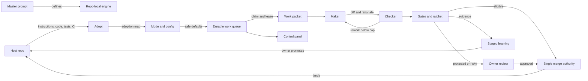
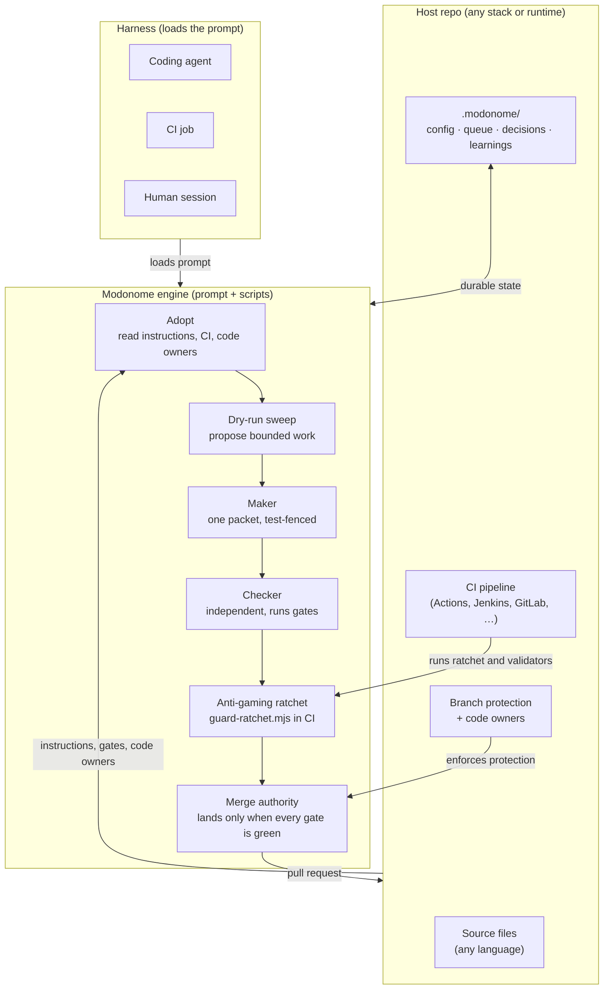
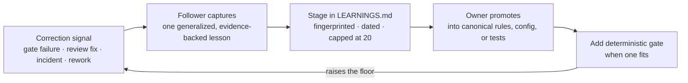

# Architecture

Modonome is a repository-local control loop. A master prompt defines it. Templates, schemas,
and scripts make its rules executable. It runs beside a host repo and works through ordinary
surfaces: files, issues, pull requests, CI checks, code owners, and status docs.

## The pieces

- The prompt (`prompts/`). A cacheable core (`modonome.core.md`) holds the invariants, the
  config levers, the operating modes, and the security rules. On-demand modules cover the
  adoption pass, the state machine, the roles, the gates, the control panel, and the network.
  `modonome.bundle.md` is the generated single-file version for harnesses that want one file.
- The templates (`templates/.modonome/`). The seed state files a host copies once: config,
  status, decisions, learnings, network, control panel, and a version marker.
- The schemas (`schemas/`). The machine-checkable contracts for config, work items, the
  adoption map, knowledge packets, and metrics. The config schema is the source of truth for
  the lever set.
- The scripts (`scripts/`). The enforcing code: build the prompt bundle, scaffold state, run
  a dry-run sweep, run the anti-gaming ratchet, validate config and packets, migrate config,
  check house style, and guard against drift.

## The loop

## How Modonome sits beside any repo

Modonome needs no central service. It reads and writes only through the surfaces the host
repo already has: files, CI, issues, and pull requests. The diagram below shows the
integration points regardless of language or platform.

The engine is stack-independent. It normalizes work by intent, evidence, and interface
contract rather than by language or framework. The `ENTERPRISE.md` adoption table lists ten
estate types: product app repos, monorepos, microservice estates, mainframe, SAP, Oracle,
Salesforce, ServiceNow, low-code or RPA, and data or BI.

## Learning and self-improvement pipeline

The engine has a defined self-improvement loop that tightens quality over time without
bypassing owner control.

Market and standards scans are handled by a dedicated market-researcher role and are off by
default. When enabled, sourced findings flow to the steward role, which scores and routes
proposals. Net-new claims need owner approval before any roadmap change. The proposal
priority score (`safety + user_value + repo_fit + reuse + evidence - effort - blast_radius -
uncertainty`) surfaces the highest-value, lowest-risk improvements first.

## Why this factoring

- One source of truth. The config schema defines the levers. The prompt and templates follow
  it. `check-drift.mjs` fails the build if they disagree, so the four representations cannot
  drift apart. This is a first-class design invariant: a tool that enforces consistency between
  its own schema, prompt, template, and migration in CI is self-governing in the same way it
  governs host repos. The drift guard is proof, not a footnote:
  the project practices what it specifies.
- Code over prose for anything load-bearing. The ratchet, the validators, and the drift guard
  run in CI, outside the agent, so the guarantees hold even under prompt injection.
- Small context per turn. A harness loads the core plus only the module it needs. The bundle
  stays available for portability.

## Calibration

The design favors verified adoption over publication count, independent validation over
self-reported scores, local repo gates over central claims, and lineage records over hidden
memory. These choices come from practical experience with autonomous coding loops and from
the research on self-evolving agent systems, which repeatedly shows that unvalidated, volume-
driven sharing degrades quality. Modonome keeps every concrete change behind a local gate.
